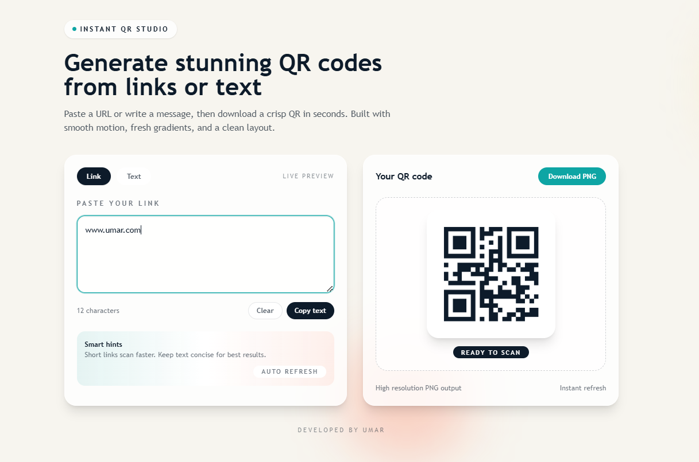

# 🚀 Instant QR Studio

Generate stunning QR codes instantly from links or text — with a modern UI, smooth animations, and real-time preview.

---

## 🌐 Live Demo

[🚀 Try Instant QR Studio](https://inst-qr-studio.vercel.app/)

## ✨ Features

* ⚡ Instant QR generation (no delay)
* 🔗 Supports URLs & plain text
* 👀 Live preview while typing
* 🎨 Clean modern UI with glassmorphism
* 📥 Download QR as high-quality PNG
* 🔄 Auto refresh
* 📱 Fully responsive design

---

## 🖼️ Preview



---

## 🛠️ Tech Stack

* ⚡ Vite
* 🎨 Tailwind CSS
* 🧠 JavaScript
* 📦 QR Code Library

---

## 📂 Project Structure

```
├── src/              # Main source code
├── dist/             # Build output
├── index.html        # Entry HTML
├── tailwind.config.js
├── vite.config.js
└── package.json
```

---

## 🚀 Getting Started

### 1. Clone the repo

```bash
git clone https://github.com/your-username/instant-qr-studio.git
cd instant-qr-studio
```

### 2. Install dependencies

```bash
npm install
```

### 3. Run locally

```bash
npm run dev
```

---

## 📦 Build for production

```bash
npm run build
```

---

## 💡 Future Improvements

* 🎨 Custom QR colors & styles
* 🖼️ Logo inside QR
* 📊 QR analytics (scan tracking)
* 🔗 Short URL integration
* 📁 History of generated QR codes

---

## 🤝 Contributing

Pull requests are welcome! Feel free to fork and improve the project.

---

## 📜 License

This project is licensed under the MIT License.

---

## 👨‍💻 Author

Made with ❤️ by Umar
=======
